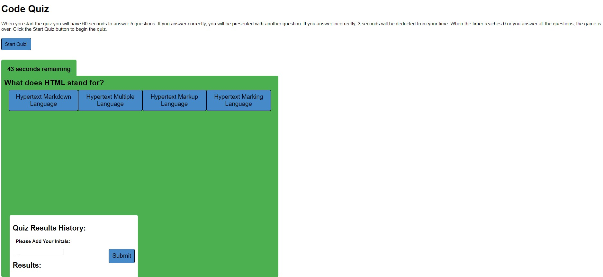

UW Coding Bootcamp Assignment 4 Code Quiz:

Created a coding quiz that when you click the start quiz button you are presented with a question and multiple choice options along with a 60 second countdown timer. if you choose wrong, you are alerted and the next question is displayed. If you are correct you are alerted and the next question is also displayed. The total number of correct answers are console logged.

*Timer is not working to reduce 3 seconds if the wrong answer is chosen

*Local storage is not working to store initals and user's score

Github Repo Link:
https://github.com/snovelli1021/Assignment4

Github Pages Link:
https://snovelli1021.github.io/Assignment4/

